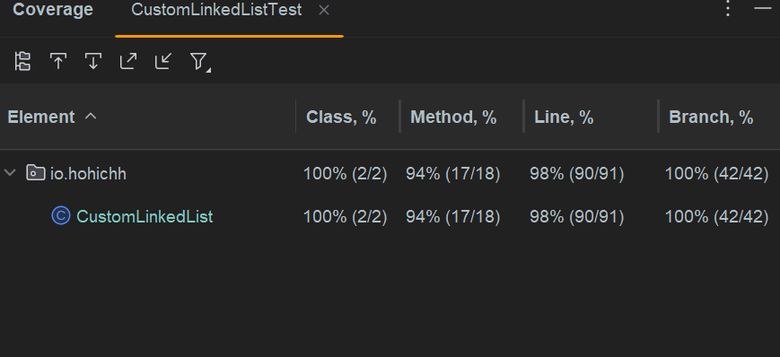

# Custom Linked List Implementation

## Task Description

The main goal of this project was to create a custom implementation of a doubly-linked list in Java, analogous to the standard `java.util.LinkedList`.

The following core operations were required to be implemented and covered by unit tests:

-   `size()` - returns the size of the list.
-   `addFirst(el)` - adds an element to the beginning of the list.
-   `addLast(el)` - adds an element to the end of the list.
-   `add(index, el)` - adds an element to the list by index.
-   `getFirst()` - returns the first element of the list.
-   `getLast()` - returns the last element of the list.
-   `get(index)` - returns the element by index.
-   `removeFirst()` - retrieves and removes the first element of the list.
-   `removeLast()` - retrieves and removes the last element of the list.
-   `remove(index)` - retrieves and removes an element from the list by index.

## Implementation Details

A key feature of this implementation is its architecture, which is based on extending the `java.util.AbstractSequentialList` (ASL) abstract class.

This approach offers a significant advantage: instead of manually implementing every single method from the `List` interface, we only need to provide a concrete implementation for the `listIterator()` and `size()` methods. The `AbstractSequentialList` class then uses our custom iterator to provide default implementations for most of the index-based operations like `get(int)`, `add(int, E)`, and `remove(int)`.

This design makes the code cleaner, more concise, and less prone to errors, as it relies on the well-tested logic of Java's standard library. The core of this project is a robust `ListIterator` implementation that correctly handles all state changes, including complex edge cases.

## Test Coverage

The reliability of the `CustomLinkedList` is ensured by a comprehensive suite of unit tests written using the **JUnit 5** framework.

The tests are designed to achieve maximum code and branch coverage for all implemented methods. Special attention was paid to testing edge cases, such as:
-   Operations on an empty list.
-   Adding and removing elements at the beginning, middle, and end of the list.
-   Correct behavior of the `ListIterator`, including the `remove()` method after both `next()` and `previous()` calls.
-   Performance optimization checks, like traversing from the head or tail in `get(index)` depending on which is closer.

These tests confirm that the custom implementation behaves as expected and is a reliable alternative to the standard `LinkedList`.

Here are some screenshots showing the tests being run and passed:


Test coverage demonstration:

## Usage Examples

Below are a few examples demonstrating how to use the `CustomLinkedList`.

```java
public class Main {
    public static void main(String[] args) {
        CustomLinkedList<String> list = new CustomLinkedList();
        list.add("A", 0);
        list.add("B", 1);
        list.addFirst("First ");
        list.addLast(" Last");
        list.add(" mid ", 2);
        printList(list);

        list.removeFirst();
        printList(list);

        list.removeLast();
        printList(list);

        list.remove(1);
        printList(list);

    }

    public static void printList(CustomLinkedList<String> list){
        for(String el: list){
            System.out.println(el);
        }
        System.out.println("______________________");
    }
}
```

Concole output:

```
First 
A
 mid 
B
 Last
______________________
A
 mid 
B
 Last
______________________
A
 mid 
B
______________________
A
B
______________________

Process finished with exit code 0
```
