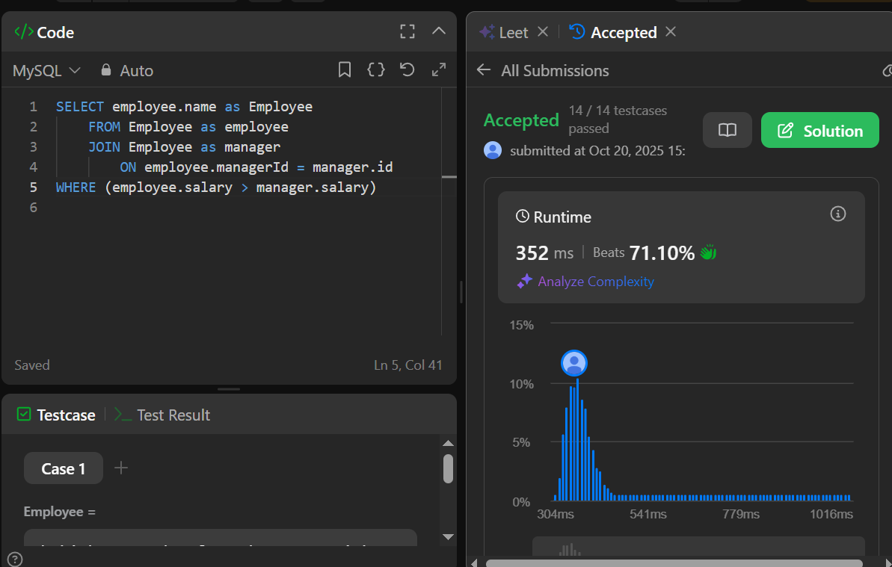
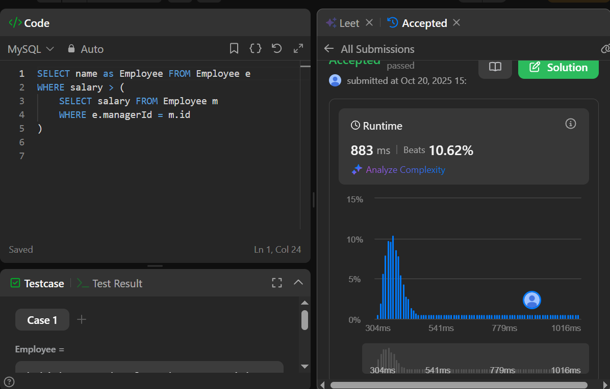
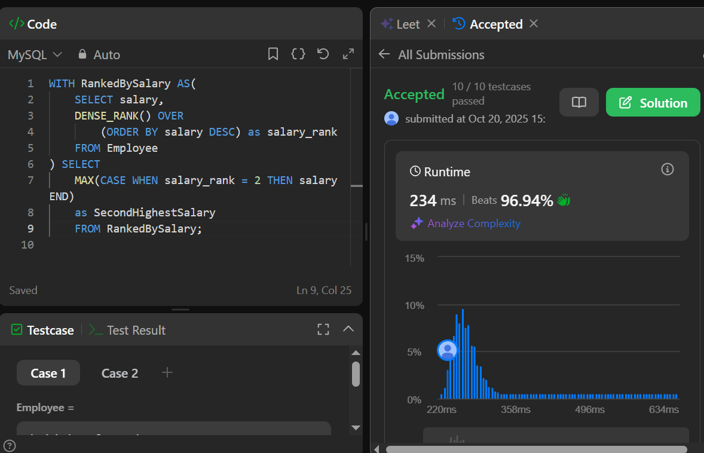
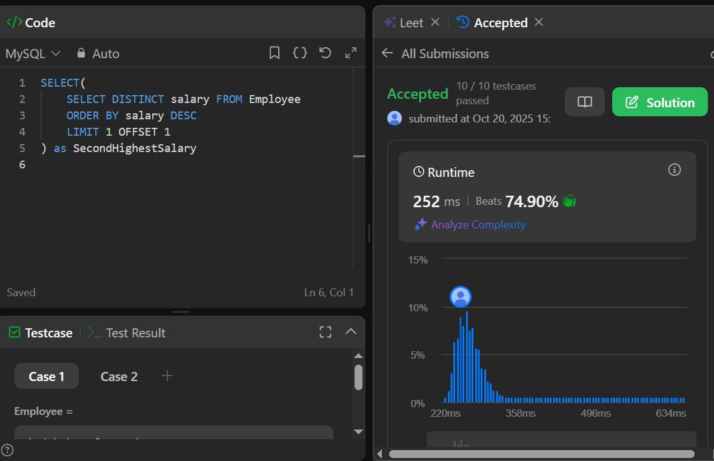
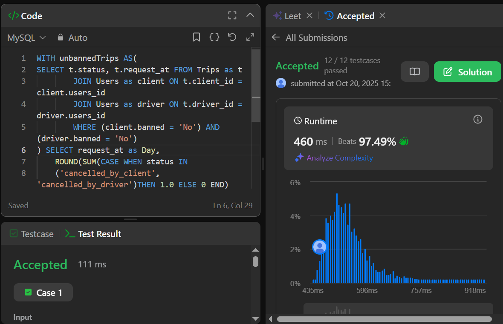

# SQL practical subsection
---
This subsection contains the following tasks:
### Task 1
Descriptioon:
[Employees earn more than their managers](https://leetcode.com/problems/employees-earning-more-than-their-managers/description/)

Query:
[employees-earn-more-than-managers.sql](employees-earn-more-than-managers.sql)

Result:

### Task 2
Descriptioon:
[Second highest salary](https://leetcode.com/problems/second-highest-salary/description/)

Query:
[second-highest-salary.sql](second-highest-salary.sql)

Result:

### Task 3
Descriptioon:
[Trips and Users](https://leetcode.com/problems/trips-and-users/description/)

Query:
[trips-and-users.sql](trips-and-users.sql)

Result:

